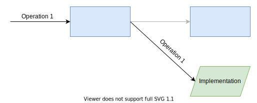
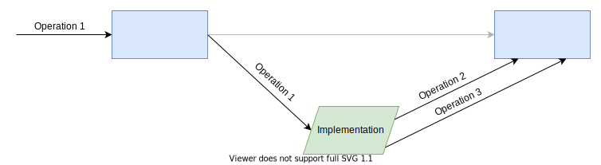
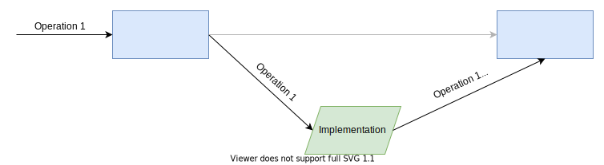
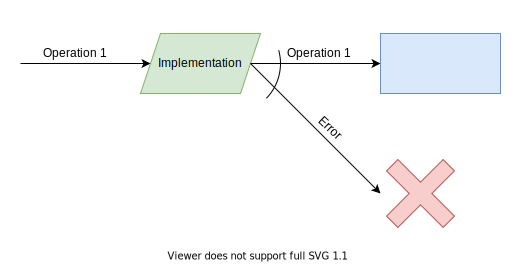
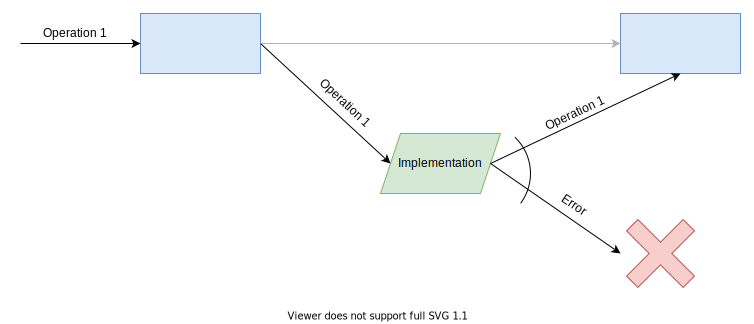
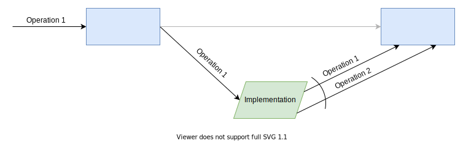

# Uaithne JS <!-- omit in toc -->

[](http://npm.im/uaithne)
[](https://travis-ci.org/juanluispaz/uaithne-js)
[](https://coveralls.io/github/juanluispaz/uaithne-js?branch=master)
[](https://bundlephobia.com/result?p=uaithne)
[](https://bundlephobia.com/result?p=uaithne)

Agile backend architecture oriented to improve the productivity of the development team using JavaScript/TypeScript.

# Summary <!-- omit in toc -->

- [Install](#install)
- [Introduction](#introduction)
  - [Goals](#goals)
  - [Philosophy](#philosophy)
  - [Principles](#principles)
  - [Design patterns](#design-patterns)
- [Example application](#example-application)
- [Understanding the framework components](#understanding-the-framework-components)
  - [Entities](#entities)
  - [Operations](#operations)
  - [Context](#context)
  - [Executors](#executors)
  - [Executors for a specific type of operation](#executors-for-a-specific-type-of-operation)
  - [Executors for all types of operations](#executors-for-all-types-of-operations)
  - [Module](#module)
- [Executing an operation](#executing-an-operation)
- [Error handling](#error-handling)
  - [Public errors](#public-errors)
  - [Internal errors](#internal-errors)
- [Execution bus](#execution-bus)
- [Layers of an application](#layers-of-an-application)
  - [Access to the bus](#access-to-the-bus)
  - [Bus example](#bus-example)
- [Patterns to weave the execution bus](#patterns-to-weave-the-execution-bus)
  - [Implement](#implement)
  - [Implement and use](#implement-and-use)
  - [Intercept](#intercept)
    - [Observer](#observer)
    - [Modifier](#modifier)
    - [Controller](#controller)
    - [Impersonator](#impersonator)
    - [Combination](#combination)
- [Structuring the operations](#structuring-the-operations)
- [API](#api)
  - [Operation type](#operation-type)
  - [Executor](#executor)
  - [Combine executors](#combine-executors)
  - [Intercept any operation](#intercept-any-operation)
  - [Filter the operations implemented by an executor](#filter-the-operations-implemented-by-an-executor)
  - [Verify if an executor implements an operation](#verify-if-an-executor-implements-an-operation)
  - [Get the implemented operation's type](#get-the-implemented-operations-type)
  - [Get the type of an implemented operation by its name](#get-the-type-of-an-implemented-operation-by-its-name)
  - [Get the operation argument type](#get-the-operation-argument-type)
  - [Get the operation argument type](#get-the-operation-argument-type-1)
  - [Get the executor context type](#get-the-executor-context-type)
  - [Public error](#public-error)
  - [Operation execution error](#operation-execution-error)
- [License](#license)

## Install

Install with [npm](https://www.npmjs.com/):

```sh
$ npm install --save uaithne
```

## Introduction

### Goals

- Easy application for backend development
- Regardless of its complexity or size
- Allow to grow without increasing complexity or reduce maintainability
- Allow to modify the behaviour easily
- Allow to improve the productivity of the team involved in the application development

### Philosophy

Get the backend to resemble a ​set of LEGO​®, where there are ​highly interchangeable pieces​ that are ​made up to achieve​ the desired result.

### Principles

- Every action performed by the application is done with commands. A command is an object that represents the action to be executed, and it contains all the information required to be achieved. These objects will be called “operations”.
- The execution of any operation is delegated to other objects that will be called “executors”.
- The execution of an operation must be possible in different layers, being the result of the sum of the actions performed in the different layers.
- The layers must have a low coupling among each other, having a minimal dependency. All the communication between layers is made between the single Executor interface, which represents a layer.
- Layers should be easily arranged, allowing adding a whole new layer in the middle of the existing ones or reorganising it, without necessary large changes in the system.
- An executor can handle all the operations that cross it or its specified ones.
- To make easy programming, operations are grouped into logical units called “modules”.
- Separation of concerns must be allowed. Thus, all the required logic that is not interrelated can be separated into different layers. Having smaller pieces of logic is possible to improve the maintainability and reusability of it.
- Build interceptors must be possible. An interceptor allows performing actions before or after the execution of an operation or when an exception is thrown. An interceptor may modify the data contained inside the operation, the result of it, or even prevent the execution of the operation. When using interceptors, it is possible to have some logic as a layer around an implementation, delegating the implementation into another layer.

### Design patterns

Uaithne is the result of an ingenious combination of design patterns:
- Command
- Chain of Responsibility
- Strategy

This combination of patterns results in a structure on which the backend of an application is built. It allows taking advantages of the Aspect-Oriented Programming features without their complications.

## Example application

To show how to use Uaithne, a small calendar application will be used as an example. This application has calendars with events. The calendar application database has the following tables:

```sql
CREATE TABLE​ calendar (
    id ​         int           NOT NULL PRIMARY KEY​,
    title ​      varchar​(30)   NOT NULL​,    
    description ​varchar​(200) 
);

CREATE TABLE​ event (
    id          int           NOT NULL PRIMARY KEY​,
    title       varchar​(30)   NOT NULL,
    start       datetime      NOT NULL,
    end         datetime      NOT NULL,
    description varchar​(200),
    calendar_id int           NOT NULL REFERENCES​ calendar(id)
);
```

## Understanding the framework components 

### Entities

In Uaithne the information and the logic must be separated; the data is represented using POJOs (Plain Old JavaScript Objects); these objects encapsulate the information without adding logic of any kind, so an entity class will only contain the fields to store the information.

For the calendar application, an entity will be created for each database table. These entities are those that will then be used to transport the information contained in their corresponding tables. The classes that represent the entities would be similar to:

```ts
interface​ Calendar { 
    id: number;
​    title: string;
    description?: string;
}

interface Event {
    id: number;
    title: string;
    start: Date;
    end: Date;
    description?: string;
    calendarId: number;
}
```

### Operations

Operations represent an action to be executed by the system, represented as an object containing the necessary information for its execution. But it never contains the logic to be executed.

An operation definition is compose of three parts:
- The type of value required to execute the operation. Typically an interface.
- The result type of the operation execution. Typically an interface or an array of an interface.
- An object that represents the type of the operation itself.

All operations type must be an instance of the ​`OperationType`​ class which definition is as follows:

```ts
class OperationType<Op, Result> {
    constructor(name: string);
    implementAs<Context>(
        executor: (operation: Op, context: Context, operationType: this) => Promise<Result>
    ): Executor<Context>;
    execute<Context>(
        operation: Op, 
        context: Context, 
        executor: Executor<Context>
    ): Promise<Result>;
    execute(
        operation: Op, 
        fn: (operation: Op, operationType: this) => Promise<Result>
    ): Promise<Result>;
}
```

This class receives as generic arguments the type of the value required to execute the operation and the result type of the operation execution; in case it doesn’t requires or return any value, the type must be `null`. The constructor of the `OperationType` class receives a name for the operation type that must be unique for all system.

The type of value required to execute an operation is modelled just like the entities; they only contain the fields where the information is stored.

All operations type must be an instance of the `​OperationType`​ class; for example, if you want to get a list of events for a particular calendar and a particular moment, you can create an operation that represents the action of getting that list that would be similar to:

```ts
interface SelectMomentEvents {
    ​calendarId: number;
    moment: Date;
}

const selectMomentEvents = new OperationType<SelectMomentEvents, Event[]>('selectMomentEvents');
```

In the ​`SelectMomentEvents​` operation:
- To execute this operation, the id of the calendar and the moment you want to consult are required.
- The type of the operation’s result is a promise containing ​`Event[]`​.

**Tip**: You can extend `OperationType` to create operations families to add more information like the definition required to validate the data.

### Context

Context is an object that contains complementary information to the execution of an operation, and its content is independent of the operation to be executed.

The information about the user's identity who performs the operation, its permissions, etc., is usually placed in the context. In web applications, the context is usually stored in the user's session because its content can not be assumed to be correct if sent from the browser without compromising the system's security.

You can treat the context class as another entity so that, just like an entity object, it only contains the fields where the information is stored.

Typical elements to include in the context:

- **User’s identifier authenticated in the application**:​ this property contains the user's identifier who is logged in, i.e., the user's identifier who entered the username and password validated in the system.

- **User’s identifier who runs the application​**: this property contains the user's identifier who is using the application; in many cases, it is the same user who logged in. But keeping both separated allows handling more complex situations, such as users who need to operate as if they were another user (typical in technical support). Doing this separation from the beginning in the application is recommended even if its use is not seen a priori; change application's logic a posteriori is very complex, regarding the low cost of handling it from the beginning.

- **Roles of the user who runs the application**​: this property contains the necessary information to know which operations can be executed by the user who is using the operation.

- **Language**​: if necessary, you can include a property that indicates the user's language, allowing some operations to take internationalization into account.

- **User information​**: if necessary, and for performance reasons, you can include some user data that, due to the frequency used, is convenient to have in the session instead of reading it constantly from the database. It is very important to include as little information as possible since its storage in the session is expensive.

- **Security tokens**​: if the application uses a security token, by instance, the token need to avoid XSRF (Cross-Site Request Forgery) attacks.

- **Database connection**​: with the database connection object. The inclusion of the database connection in the execution context allows to easily control the transactionality of the system and its scope.

When executing an operation, the execution context is always available, and it can be used to complete the information needed to execute it.

It is very convenient to create contextualized operations instead of more generic ones; it is preferable to create an operation "Give me my policies" instead of the more generic "Give me the policies of the indicated user". The creation of contextualized operations greatly reduces the security problems related to the user's identity since the user's identity is read from the context that is always stored in a secure place (as in the user's session on the server) instead of relying on the requestor.

It is recommended ​to **use contextualized operations instead of the more generic ones**​, even if that implies having two operations that apparently do the same, except that one reads the information from the context and the other from the operation.

Example of context for the calendar management application:

```ts
interface Context {
    userId: number;
    realUserId: number;
    roles: string[];
    userName: string;
    language: string;
​    xsrfToken: string;
​    databaseConnection: Connection;
}
```

**Tip**: ou can use different types of context in different places of the application, like in different layers.

### Executors

An executor contains the implementation of one or several operations.

An executor is in charge of executing the logic associated with an operation, and there may be two cases:
- Execute a logic for ​operations of a specific type
- Execute a logic for ​all the operations​ that go through the executor (an interceptor for all operations)

Executor's type is an opaque type that doesn't expose any property or method.

### Executors for a specific type of operation

To create an executor that performs a task for a particular type of operation, simply call the method `implementAs` in the operation type specifying as generic argument the context type and as argument the function to be executed for the operation. For the implementation function, the first argument is the operation, the second is the context, the third is the operation type, and the return is the result of the operation.

For example, if you want to create an executor that implements the `​SelectMomenEvents` operation, the code would be similar to:

```ts
const selectMomentEventsExecutor = selectMomentEvents.implementAs<Context>(async (operation, context, operationType) => {
    // ...
});
```

### Executors for all types of operations

An executor that intercepts the execution of any operation performs a task regardless of the type of operation. To create an executor that intercepts the execution of any operation, simply call the function `interceptAnyOperation` passing as argument the executor that contains the operations to intercept and the function to be executed for any operation requested to be executed. For the implementation function, the first argument is the operation; the second is the context; the third is the operation type; the fourth is an executor that allows you to continue executing the operation (it is not the same object that the `interceptAnyOperation` function receives as the first argument), and the return is the result of the operation. Example:

```ts
const allOperationsInterceptor = interceptAnyOperation(bussinessLayer, async (operation, context, operationType, next) => {
    // Logic to be executed before the execution of the operation
    const result = await operationType.execute(operation, context, next);
    // Logic to be executed after the execution of the operation
    return result
});
```

This type of executors usually ends up  ​executing the operation in the ​next​ executor. It is usually used in tasks such as:
- Writing in the log
- Opening and closing of the transaction
- In combination with the use of interfaces or base classes; it is possible to verify if the operation implements a type and, based on this, perform a logic

### Module

You can create the implementation of several operations and then combine them into one single executor. And, if you define a function that constructs that combined executor, you will be able to define all the modules required by your application flexibly. The module creation function can receive parameters (by example, some configuration) that you can use during the module's initialisation. If you would like to create the Event module that implements `SelectMomentEvents` and `SelectEventById`​ operations, the code would be similar to:

```ts
function createEventsDatabaseModule(/* any required params*/) {

    const selectMomentEventsExecutor = selectMomentEvents.implementAs<Context>(async (operation, context, operationType) => {
        // ...
    });

    const selectEventByIdExecutor = selectEventById.implementAs<Context>(async (operation, context, operationType) => {
        // ...
    });

    return combineExecutors(selectMomentEventsExecutor, selectEventByIdExecutor);
}
```

**Note**: If an operation is implemented in several modules passed as arguments to the `combineExecutors`, the last argument that implements it will be used to get the implementation included in the resulting executor.

## Executing an operation

To execute an operation, you must invoke the `​execute​` method of the operation type passing by argument the data required to execute the operation, the context object,  and the executor where the operation will be executed. Example:

```ts
const op: SelectMomentEvents = { /*...*/ }
const context: Context = { /* ... */ }

const result: Promise<Event[]> = selectMomentEvents.execute(op, context, executor);
```

## Error handling

If an exception occurs during the execution of an operation, Uaithen automatically collects the execution entry so that some log can subsequently register it. For this, a new exception is created that internally includes the unhandled exception, the operation and the context so that you have all the necessary information to reproduce the problem.

### Public errors

If you want to have your own exceptions that Uaithne does not alter, these exceptions must extend from `​PublicError`​, whose definition is the following:

```ts
class PublicError extends Error {
    readonly cause: unknown;
    constructor(message?: string, cause?: unknown);
}
```

### Internal errors

Any exception that doesn’t extend from ​`PublicError​` will be treated as an internal exception, representing an abnormal functioning of the system. Uaithe will collect the necessary information to reproduce the problem easily inside the exception.

Information collected when an exception occurs:
- The exception​ occurred during the execution of the operation
- The operation​ that caused the exception
- The context​ object used during the execution of the operation

To collect the execution information, what is done is to raise an exception of type `OperationExecutionError`​, for which the definition is:

```ts
class OperationExecutionError extends Error {
    readonly cause: unknown;
    readonly simpleMessage: string;
    readonly operationType: OperationType<unknown, unknown>;
    readonly operation: unknown;
    readonly context: unknown;

    constructor(
        operation: unknown, 
        context: unknown, 
        operationType: OperationType<unknown, unknown>, 
        message?: string, 
        cause?: unknown
    );
    
    sameContent(
        operation: unknown, 
        context: unknown, 
        operationType: OperationType<unknown, unknown>
    ): boolean;
    
    static stringifyContext: (
        context: unknown, 
        operationType: OperationType<unknown, unknown>
    ) => string;
    static stringifyOperation: (
        operation: unknown, 
        operationType: OperationType<unknown, unknown>
    ) => string;
    static createErrorMessage: (
        operation: unknown, 
        context: unknown, 
        operationType: OperationType<unknown, unknown>, 
        message?: string, 
        cause?: unknown
    ) => string;
}
```

As the internal exception goes through the different executors that make up the execution sequence, it is checked if the operation and context object contained in the exception are the same as those used for the execution (using the `​sameContent​` method). Suppose the operation or the context object is different. In that case, a new `OperationExecutionError` exception is created with the previous internal exception and the operation and context objects that correspond to the execution at that point. In that way, for example, if an operation implementation executes another operation that fails, the resulting exception will contain the information of both operations.

The ​`simpleMessage`​ property contains the simple message of the exception, without any part created automatically by it. If it does not have its own message, it uses the message of the internal exception. The created message includes the message specified for the operation (or, in its absence, the message of the internal exception). Then the name of the operation type is added, the string representation of the operation and the context. In this way, when an error occurs, all the input information of the system used to execute the operation is available, thus having all the necessary information to reproduce the error.

When the exception is created, an extended error message is constructed with the string representation of the operation and the context object. Thus ensuring that the information contained there corresponds to the moment in which the exception was initiated. The error message will contain the value that the operation and the context object had at the time of the error. If the content of the context object or the operation changes during the treatment of the exception, the message will not reflect these changes. Having the string representation of the information allows you to recreate with accuracy the situation that caused it.

**Note**:​ You can replace static property `stringifyOperation` or `stringifyContext` to specify a new function that transforms in JSON the operation or context. You can go even further and replace the static property `createErrorMessage`​ to specify a new function that constructs the error message of any `OperationExecutionError`.

## Execution bus

The base of Uaithne is the operations that can have implementations in different executors. The executors can be composed to create a new one with the sum of the operation's implementations made in the different executors. All this composition of executors makes up the execution bus of the application.

The central idea in the construction of the different executors is to perform the separation of concerns where each implementation is dedicated, as far as possible, to a single task.

For example, to register a user in the system, it is required:
- Encrypt the password
- Insert the user in the database
- Send the welcome email
- Insert the audit log
- Write in the application log

Each item of this list corresponds to one concern, which should be implemented separately, each of them in its own executor, and then be composed to a bus fragment responsible for its execution.

By decomposing the logic in this way, there is a central element that corresponds to the main action, which in this case is the insertion of the user in the database, and another series of elements that complement or condition the main action, wrapping it within their own logic; these are called interceptors and have a behaviour similar to triggers in the database.

Interceptors, at some point, usually end up invoking the execute method using another executor, typically received as an argument of the module creation function. Example:

```ts
function createEventsInterceptorModule(next: Executor<Context>) {

    const selectMomentEventsInterceptor = selectMomentEvents.implementAs<Context>(async (operation, context, operationType) => {
        ​// Logic to be executed before the execution of the operation ​
        const result = await operationType.execute(operation, context, next);
        // Logic to be executed after the execution of the operation
        return result
    });

    return combineExecutors(next, selectMomentEventsInterceptor);
}
```

**Note**: The first argument passed to the function `combineExecutors` is the next executor; that means the `EventsInterceptorModule` will expose all the operations included in the next executor; but, in the case of the `SelectMomentEvents`, the implementation to be used is the one provided as the second argument.

When the execution bus is assembled, the instances of the different executors are linked to building a line of execution of a group of operations, typically grouped by its module. Example:

```ts
createInterceptEventsModule(createEventsDatabaseModule())
```

When you try to execute the `​SelectMomentEvents`​ operation in this example, the interceptor in the `EventsInterceptorModule` is executed before reaching the implementation of `EventsDatabaseModule`. The result of the execution is the sum of the logic contained in each executor.

You can combine several sections of the bus in a single one using the `combineExecutors` function; then, in the end, the resulting executor will be a bus that contains all the logic for the operations defined in the different sections.

For example, when you divide the database access layer into different modules, different execution bus segments appear, which must be grouped into a single executor that represents this layer, for which you could do something like the following:

```ts
const databaseLayer = ​combineExecutors(​
    createCalendarsDatabaseModule(), 
    createEventsInterceptorModule(​createEventsDatabaseModule())
);
```

By doing this, the executor `databaseLayer` is able to execute all the operations implemented in ​`CalendarsDatabaseModule`​, ​`EventsInterceptorModule`​ and in `EventsDatabaseModule`​.

## Layers of an application

In a typical configuration for an information system, the system contains at least the following clearly defined layers:

- **Data access**​: In this layer, all the necessary implementations are placed to access the data (for example, from the database); some of them may have some interceptors to complement the main action.

- **Backend**​: In this layer, all the implementations that represent actions in the system not centred in the database are placed (although they could make use of it), for example, user authentication management; some of these implementations may have some interceptors to complement the main action.

- **Frontend​**: Optional. In many circumstances, it is required to group several operations in one, thus avoiding having to chain requests to the server, which destroys the application's performance, or because you want to ensure that everything is executed within the same transaction. The frontend layer is the one in which all the implementations of these operations are placed. In the implementation, the logic of these operations is broken down into other actions in the system. Still, these operations never represent a real action in the system by itself, but rather it is a mere grouping of operations for convenience reasonse.

    It is very important to take into account that if requests are made to the server, whose response will be used to request another request from the server, this type of sequential chaining of actions is usually harmful to the performance of the application. As far as possible, it should be avoided. So in case you need this type of chain of requests, it is best to group them into one For this, a convenience operation is created whose implementation does not do more than execute each of the required operations and returns an entity that usually contains one property with the result per each of the operations executed.

    Another easy case to forget is the scope of the transactionality of the system; if a series of requests are invoked from an external system (for example, the browser), each request has its own transaction. If it is desired that several requests share a single transaction, it is necessary to convert them into a single request following the same scheme described above.

Additionally, some interceptors that do not distinguish the type of operation are usually added:

- **Database transaction scope management**​: this interceptor assigns the connection to the database to be executed in the following layers and controls the transaction so that all the actions executed after it in the database they are in the same transaction, which will ​rollback​ if the result of the execution of the operation ends in an exception; otherwise a ​commit​ is made.

- **Writing in the application log**​: this interceptor writes in the log of the application any error that occurs during the execution of an operation. This interceptor, typically, when it is in the development environment, writes the input operation and context and the result of the operation additionally.
  
- **Permission validation**: Optional. You can introduce an interceptor that validates if the user has permissions to execute the requested operation. If the user has no enough permission, it throws an exception indicating that the requested operation cannot be performed.
  
- **Data validation**​: Optional. If a validation library is used, this interceptor allows validating that the data coming from external systems comply with all the validations placed on operations and entities. If it doesn’t comply with them, it throws an exception indicating that the supplied data do not meet the requirements.

### Access to the bus

The construction of the bus is done statically for the entire application, in a singleton or global variable. In this way, the bus is built only once for the whole application during its initialisation. 

There can be two different entry point for the bus of the application:
- **serviceBus**​: Contains the execution bus to be used by services exposed by the application for consumption by external applications, for example, the browser.
- **internalBus**​: Contains the execution bus to be used internally by the application.

This separation allows having certain differences depending on which entry point is invoked, for example, for external services which have to go through the validation interceptor of the data, but not for the internal bus.

### Bus example

The ​`createBus` function contains the bus initialization, which is executed only once during the initialization of the application. This function could look like this:

```ts
function createBus() {
    const databasePool = createDatebasePool();

    const databaseLayer = ​combineExecutors(
        createCalendarsDatabaseModule(),
        createEventsDatabaseModule(),
        createEncryptPasswordInterceptorModule(createUsersDatabaseModule()),
        // ...
    );

    const backendLayer = ​combineExecutors(
        databaseLayer,
        createAuthenticationModule(databaseLayer),
        // ...
    );

    const frontendLayer = ​combineExecutors(
        backendLayer,
        createGroupedOperationsModule(backendLayer),
        // ...
    );

    const sqlSessionInterceptor = createSqlSessionInterceptor(frontendLayer);
    
    const internalBus = createLogDebugInterceptor(sqlSessionInterceptor);

    const permissionLayer = createPermissionInterceptor(validationLayer);
    const validationLayer = createValidatorInterceptor(permissionLayer);
    const serviceBus = createLogDebugInterceptor(validationLayer);

    return { internalBus, serviceBus };
}
```

It should be noted that the instances of each executor are created only once and are reused to execute different operations in different execution request, so it is important that internally they don’t store the state of the application. Consequently, any global variable within the executors should be to store the configuration of the execution bus and not store information relating to the execution of a particular operation.

## Patterns to weave the execution bus

When performing the configuration of the execution bus, a series of typical patterns arise depending on the desired behaviour and can be combined to achieve many more complex behaviours.

### Implement

This is the simplest case in which the implementation module is added to the execution bus without it being dependent on any other module. This pattern is used to add the module's logic, which can be complemented in the outer layers.

> 
> 
> *Execution bus section using a combined executor with a next executor.*

> 
> 
> *Execution bus section using a combined executor without a next executor, only implementations.*

### Implement and use

In this case, the implementation of a module initiates the execution of operations of other modules that are implemented at a more internal level of the bus. At the end of the process, the result of the first operation executed depends on the result of the following operations (without the invoker knowledge). This pattern is used to add the logic to a module where the implementation requires other operations.

> 
>
> *Execution bus section with an implementation that delegates the execution of internal operations in the next executor.*

### Intercept

An interceptor is an element that gets in the flow of execution of the operation, allowing to modify its behaviour; for example, it can be said that a database trigger acts as an interceptor of the operations performed on a table.

The objective of an interceptor is to complement the logic of execution of an operation. An interceptor must be able to separate the logic of the operation into different competences; for example, the logic to write in the application log inside an interceptor, the logic to check if the user has permission to execute the requested operation inside another interceptor, and finally the logic to access to the database inside the implementation. In this form, the result of the execution of the operation is the sum of the three parts.

Separating the logic into different competences allows improving the maintainability of the code and its readability and facilitating its reuse. By separating each competence in a different piece, you can achieve code pieces with high cohesion and low coupling, greatly facilitating its modification of the system. When they are separated, it is also possible to reorder them, add more interceptors between two existing ones, etc. Thus, allowing to restructure the execution bus completely without this entailing a great effort.

Depending on the behaviour of the interceptor, it can be classified as: observer, modifier, controller, impersonator and a combination of the previous ones.

#### Observer

In this case, the interceptor behaves as a mere observer of the operation that crosses this interceptor, without making any change to the operation or in its execution flow; for example, an interceptor that writes in the application log the operation and its result.

> 
> 
> *Interceptor interposed directly before the implementation.*

> 
>
> *Interceptor interposed by using a branch of the execution bus using a next executor.*

#### Modifier

In this case, the interceptor modifies the operation or its result. This type of interceptors can be used to complete the information needed to execute the operation, but that is not provided by the person requesting its execution; for example, adding the user's information who requests the execution of the operation, taking it from the session. You can also use this type of interceptors to prepare the information of the operation that needs to be treated before its execution; for example, encrypting the password of the user before checking if it can log in to the application.

> 
>
> *Interceptor interposed directly before the implementation.*

> 
>
> *Interceptor interposed by using a branch of the execution bus using a next executor.*

#### Controller

In this case, the interceptor decides if the operation should continue its execution or otherwise stop it, being able to throw an exception (or returning a defined value, depending on the desired behaviour). For example, you can use this type of interceptors to ensure that only those users who have permission can execute an operation, and in case of not having it, throw an exception.

> 
>
> *Interceptor interposed directly before the implementation.*

> 
>
> *Interceptor interposed by using a branch of the execution bus using a next executor.*

#### Impersonator

In this case, the executed interceptor transforms the operation into a second operation that does the task that must have been executed by the first operation, giving the impression that the first operation has been executed. This type of interceptor is useful if, for example, you want to maintain compatibility with an operation that is no longer part of the system, so you have to translate it into a new operation that the system can understand.

> 
>
> *Interceptor interposed directly before the implementation.*

> 
>
> *Interceptor interposed by using a branch of the execution bus using a next executor.*

#### Combination

An interceptor can combine any of the behaviours indicated above, so it is possible, for example, to have an interceptor that acts as an impersonator-controller, that under certain circumstances allows the operation to be executed and in others to supplant it by another one. An interceptor controller-impersonator could be useful, for example, in circumstances in which data is normally extracted from a source (the database of the application, for example) but in certain cases must be extracted from an alternate source (if it was not found in the database, for example).

> 
>
> *Interceptor interposed by using a branch of the execution bus using a next executor.*

## Structuring the operations

You can see some recommendations about how structuring the operation that can apply to some projects at [Structuring the operations page](readme/structuring.md)

## API

### Operation type

```ts
class OperationType<Op, Result> {
    readonly name: string;

    constructor(name: string);

    implementAs<Context>(
        executor: (operation: Op, context: Context, operationType: this) => Promise<Result>
    ): Executor<Context>;
    execute<Context>(
        operation: Op, 
        context: Context, 
        executor: Executor<Executor>
    ): Promise<Result>;
    execute(
        operation: Op, 
        fn: (operation: Op, operationType: this) => Promise<Result>
    ): Promise<Result>;
}
```

When you instantiate this class, you create a new operation type. 

**Generic arguments**:
- `Op`: indicate the type of the data required to execute the operation.
- `Result`: indicate the type of the result of executing the operation.

**Constructor**:
  This class receives as constructor's argument the name of the operation that must be unique in all application.

**Properties**:
- `name`: name of the operation type received as argument of the constructor.

**Methods**:
- `implementAs`: allows to create an implementation of the operation, receives as argument a function with the implementation and returns the executor with the implementation. The implementation function receives as first argument the data to execute the operation, as second argument the context object, as third argument the operation type and returns a promise with the result of the operation's execution.
- `execute` (first overload): allows executing an operation with the implementation provided within an executor. This function receives as the first argument the data required to execute the operation, as second argument the context object, as third argument the executor that contains the operation implementation and returns a promise with the result of the operation's execution.
- `execute` (second overload): allows executing an operation with the implementation function provided as the second argument. This function receives as the first argument the data required to execute the operation, as the second argument a function with the implementation of the operation and returns a promise with the result of the operation's execution. The implementation function receives as first argument the data to execute the operation, as second argument the operation type and returns a promise with the result of the operation's execution.

### Executor

```ts
interface Executor<Context> {
}
```

The interface `Executor<Context>` is an opaque type containing the implementation of one or many operations.

**Generic arguments**:
- `Context`: that indicates the type of the context object expected by the implementations.

### Combine executors

```ts
function combineExecutors<Context>(...executors: Array<Executor<Context>>): Executor<Context>
```

Combine multiple executors in a single one. If an operation is implemented in several modules passed as arguments to the `combineExecutors`, the last argument that implements it is the one to be used to get the implementation included in the resulting executor.

**Arguments**:
  The executors to be combined in a single one ordered by priority (the last one have more priority).

**Returns**: Executor that combines the other executors.

### Intercept any operation

```ts
function interceptAnyOperation<Context>(
    executor: Executor<Context>, 
    interceptor: (
        operation: unknown, 
        context: Context, 
        operationType: OperationType<unknown, unknown>, 
        next: Executor<Context>
    ) => Promise<unknown>
): Executor<Context>
```

Create an executor that intercepts the execution of any operation implemented by the executor received as the first argument.

**Arguments**:
- `executor`: executor that contains the implementation of the operations to be intercepted.
- `interceptor`: function with the interceptor implementation. This function receives as the first argument the data required to execute the operation, as the second argument the context object, as the third argument the operation type, the fourth is an executor that allows you to continue the operation's execution. The return is the result of the operation. Note: the fourth argument received by the interceptor function it is not the same object that the `interceptAnyOperation` function receives as the first argument.

**Returns**: Executor that contains the implementation of the operations (implemented within the executor receives as the first argument) intercepted by the interceptor.

### Filter the operations implemented by an executor

```ts
function filterImplementationsByOperationType<Context>(
    executor: Executor<Context>, 
    filter: (operationType: OperationType<unknown, unknown>) => boolean
): Executor<Context>
```

Create an executor that only implements the operations approved by the filter function passed as the second argument from the executor passed as the first argument. It returns a new executor that contains the approved operations.

**Arguments**:
- `executor`: executor that contains the operation to filter.
- `filter`: a function that determines if an operation type can be included in the final executor.

**Returns**: Executor that only contains the operations approved by the filter function with the implementation contained in the executor received as the first argument.

### Verify if an executor implements an operation

```ts
function hasOperationImplementation(
    executor: Executor<any>, 
    operationType: OperationType<unknown, unknown>
): boolean
```

Allows verifying if an executor contains an implementation for an operation type.

**Arguments**:
- `executor`: executor that contains the operation's implementation.
- `operationType`: type of the operation to query.

**Returns**: Boolean that indicates if the executor received as the first argument contains an implementation for the operation type received as the second argument.

### Get the implemented operation's type

```ts
function getImplementedOperations(
    executor: Executor<any>
): OperationType<unknown, unknown>[]
```

Obtains a list with the operation type implemented within the executor provided as argument.

**Arguments**
- `executor`: executor that contains the operation's implementation.

**Returns**: A list of the operation types implemented by the executor received as argument.

### Get the type of an implemented operation by its name

```ts
function getImplementedOperationByName(
    executor: Executor<any>, 
    operationName: string
): OperationType<unknown, unknown> | undefined
```

Obtains the operation type of an implemented operation given its name (as the second argument) from an executor (received as the first argument).

**Arguments**
- `executor`: executor that contains the operation's implementation.

**Returns**: Operation types implemented by the executor with name received as argument or `undefined` if the executor doesn't implement the operation.

### Get the operation argument type

```ts
type OperationArgumentType<Type extends OperationType<any, any>>
```

This type returns the type of the data required to execute an operation.

**Generic arguments**:
- `Type`: Type of the operation that the argument type want to be known.

### Get the operation argument type

```ts
type OperationResultType<Type extends OperationType<any, any>>
```

This type returns the type of the result of the execution of an operation.

**Generic arguments**:
- `Type`: Type of the operation that the result type want to be known.

### Get the executor context type

```ts
type ExecutorContextType<ExecutorType extends Executor<any>>
```

This type returns the type of the context object required to execute an operation with this executor.

**Generic arguments**:
- `Type`: Type of the operation that the result type want to be known.

### Public error

```ts
export declare class PublicError extends Error {
    readonly cause: unknown;
    constructor(message?: string, cause?: unknown);
}
```

Class that represents a public error; this means it this not transformed by Uaithne. 

**Constructor**:
- `message`: message of the error.
- `cause`: any error that originated this error.

**Properties** (additional to the `Error` class):
- `cause`: error that originated this error.

### Operation execution error

```ts
class OperationExecutionError extends Error {
    readonly cause: unknown;
    readonly simpleMessage: string;
    readonly operationType: OperationType<unknown, unknown>;
    readonly operation: unknown;
    readonly context: unknown;

    constructor(
        operation: unknown, 
        context: unknown, 
        operationType: OperationType<unknown, unknown>, 
        message?: string, 
        cause?: unknown
    );
    
    sameContent(
        operation: unknown, 
        context: unknown, 
        operationType: OperationType<unknown, unknown>
    ): boolean;
    
    static stringifyContext: (
        context: unknown, 
        operationType: OperationType<unknown, unknown>
    ) => string;
    static stringifyOperation: (
        operation: unknown, 
        operationType: OperationType<unknown, unknown>
    ) => string;
    static createErrorMessage: (
        operation: unknown, 
        context: unknown, 
        operationType: OperationType<unknown, unknown>, 
        message?: string, 
        cause?: unknown
    ) => string;
}
```

Class that represents an error occurred during the execution of an operation.

**Constructor**:
- `operation`: data of the operation that was executing when the error appears.
- `context`: context object used to execute the operation.
- `operationType`: type of the executed operation.
- `message`: message of the error
- `cause`: any error that originated this error.

**Properties** (additional to the `Error` class):
- `operation`: data of the operation that was executing when the error appears.
- `context`: context object used to execute the operation.
- `operationType`: type of the executed operation.
- `cause`: error that originated this error.
- `simpleMessage`: contains the simple version of the error message. By default, the error message is extended with more information that included the operation type's name, the string representation of the operation and the context object.

**Methods**:
- `sameContent`: verify if the error was originated by the same operation data, context object and operation type.

**Static methods** (you can replace with a new implementation):
- `stringifyContext`: a function that returns the JSON representation of the context object received as the first argument during the execution of an operation type received as the second argument.
- `stringifyOperation`: a function that returns the JSON representation of the data required by an operation received as the first argument during the execution of an operation type received as the second argument.
- `createErrorMessage`: a function that returns the error message to be used by the error. This function receives the same arguments that the constructor of this class. By default, the error message is extended with more information that included the operation type's name, the string representation of the operation and the context.

## License

MIT